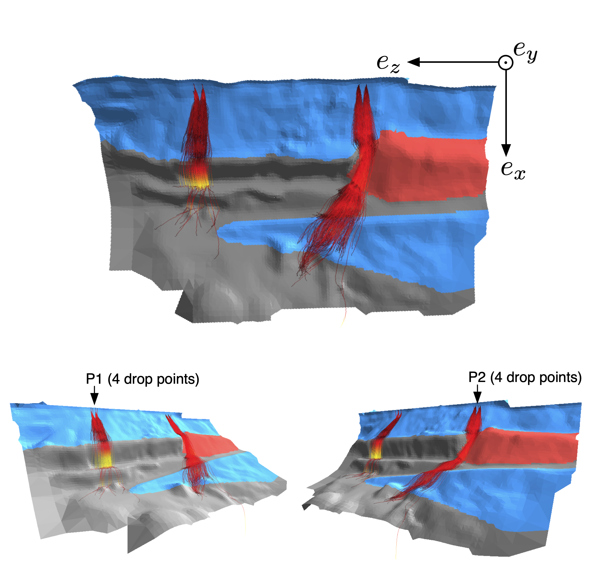
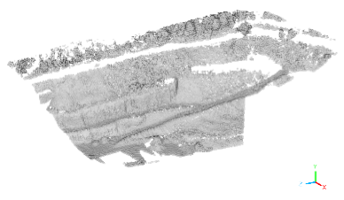
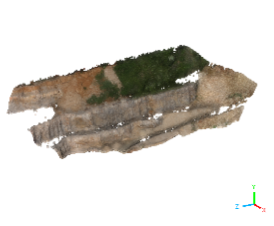
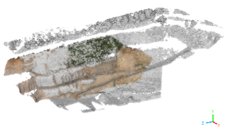
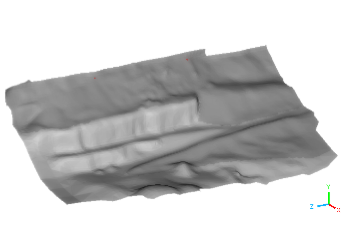
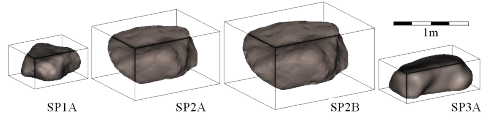

# Experimental and simulated datasets for 3D dynamic modeling of rockfalls

This repository contains experimental and simulation data on rock boulder releases conducted in an open-pit mine in Authume (France), using a shovel from two distinct release positions. The tests were carried out within the framework of the French national project [C2ROP](https://www.c2rop.fr).

## Abstract

We provide experimental and simulation data on rock boulder releases conducted in an open-pit mine in Authume (France). The dataset served as the basis for the original paper by Garcia et al. (2022). The first path of propagation (profile) features a relief in the form of stairs, with platforms with a rather hard substratum (stabilized ground). The second profile presents a slightly curved corridor on a rather soft substratum. The boulder's end points (_i.e._, the stop positions) are made available together with their masses and bounding box sizes. In addition, the Digital Terrain Model, reconstructed from Lidar cloud of points in the form of a STL model, is provided together with a zoning of the type of substratum. Three boulder shapes have been reconstructed in 3D by means of the stereo-photogrammetry technique (their respective point clouds are also provided), and some forecasts from discrete element simulations using the code Rockable are provided so that other research teams can compare them with their own predictions.

## Use cases for this dataset?

- The experimental datasets are valuable for developing and improving numerical tools used on rockfall mitigation
- They provide real-world measurements to validate and refine rockfall simulation models based on trajectory paths and end points
- The dataset enables researchers to test the accuracy of predictive algorithms and reduce reliance on theoretical assumptions
- This empirical foundation enhances the reliability of risk assessments and standardizes comparisons across studies
- The data transform abstract models into practical, evidence-based tools for rockfall mitigation

## Data description

The data are organized into three main categories: field data, 3D-reconstructed models, and simulated datasets.

### FIELD DATA

#### Measured block-endpoints

The folder `EXP_endpoints/` contains data from experimental stop-points for 89 blocks released over two profiles:

- `Endpoints_P1.txt`: 41 boulders on profile P1
- `Endpoints_P2.txt`: 48 boulders on profile P2 (boulder at line #37 is the one with shape SP3A used for simulations)

These are space-delimited text files (_i.e._, CSV files, but using spaces instead of commas or semicolons as separators) with the following columns:

| Column | Description |
|--------|-------------|
| 1      | Xstop [m]   |
| 2      | Ystop [m]   |
| 3      | Zstop [m]   |
| 4      | mass [kg]   |
| 5      | L1 [m]      |
| 6      | L2 [m]      |
| 7      | L3 [m]      |

where L1, L2, and L3 (with L1 ≥ L2 ≥ L3) represent the approximate dimensions of the best-fitted bounding box of the rock block.

#### Field photographs

Additional photographs are included to help future operators assess subjective qualities of the ground, such as softness or roughness. These photographs are essential for estimating dissipative parameters in rockfall models.

> 
> _Drop points and propagation profiles P1 and P2 in the Authume quarry (France)._

> 
> _Boulder numbered 89 during the experimental campaign. It was used in both experimental tests and simulations._

### 3D-RECONSTRUCTED MODELS

A global shift can be applied to align all terrain-assessed coordinates into a common reference GPS coordinate system:

- $\Delta x = -888600$ m
- $\Delta y = -6671300$ m  
- $\Delta z = 0$ m

#### Digital Terrain Model (DTM)

The terrain topology is provided in the folder `Geometries/` in two formats:

- `STL/` subfolder: ASCII STL files split into three files representing blue, gray, and red zones
- `Point_cloud/` subfolder: Raw point clouds as ASCII text files

The three STL files correspond to different types of substrata:

- **Blue zones**: Vegetated slopes
- **Gray zone**: Hard surfaces (vertical rock walls and horizontal sturdy soil)
- **Red zone**: Rocky slope

> 
> _Trajectories over the reconstructed terrain for profiles P1 and P2. Trajectory colors represent block velocities (red to yellow)._

The DTM was constructed using photogrammetry from aerial photographs taken by a drone (DJI Mavic Pro), provided by IMSRN company. A dense point cloud from C2ROP organization was used as reference for alignment and reconstruction of missed areas.

>    
> _Processing of point clouds and mesh: (a) Dense point cloud from IMSRN, (b) Dense point cloud from C2ROP, (c) Alignment of acquisitions, (d) Reconstructed TIN mesh (0.5 m resolution)._

#### Digital model of the boulders

Three boulder shapes were reconstructed using photogrammetry and used in simulations:

- **SP1A**: Smallest volume
- **SP2A** and **SP2B**: Same shape, different volumes
- **SP3A**: Most elongated, used in experimental tests

The reconstruction process involved:

- Image acquisition at 15-degree intervals (360-degree rotation)
- Use of 60 cm × 60 cm checkerboards for scaling
- Point cloud generation with Agisoft Metashape
- Mesh reconstruction via Delaunay triangulation using MeshLab

> 
> _Shapes of blocks reconstructed by photogrammetry._ 

### SIMULATED DATASETS

#### Drop Conditions

The folder `Drop_conditions/` contains:

- `orientations.txt`: 64 initial orientations as normalized quaternions ($q_0$; $q_1$, $q_2$, $q_3$)
- `positions_P1.xyz` and `positions_P2.xyz`: Drop positions for each profile

#### Simulated Trajectories

Rockfall simulations were conducted using the [Rockable](https://github.com/richefeu/rockable) software. The folder `SIM_Trajectories/` contains 2048 computed trajectories organized as:

`SIM_Trajectories/<Profile>/<Shape>/<Drop_position>/<Orientation>.txt`

where:

- Profile = {`P1`, `P2`}
- Shape = {`SP1A`, `SP2A`, `SP2B`, `SP3A`}
- Drop_position = {`Drop_position_1`, `Drop_position_2`, `Drop_position_3`, `Drop_position_4`}
- Orientation = `orientation_[1-64]`

Each trajectory file contains 19 seconds of simulated data (0.1 s intervals) with 20 columns:

| Column | Description                                                   |
|--------|---------------------------------------------------------------|
| 1      | Time $t$ [s]                                                  |
| 2-4    | Position ($x$, $y$, $z$) [m]                                  |
| 5-7    | Translation velocity ($v_x$, $v_y$, $v_z$) [m/s]              |
| 8-11   | Orientation quaternion ($q_0$; $q_1$, $q_2$, $q_3$) [-]       |
| 12-14  | Angular velocity ($\omega_x$, $\omega_y$, $\omega_z$) [rad/s] |
| 15-17  | Resultant force ($F_x$, $F_y$, $F_z$) [N]                     |
| 18-20  | Resultant moment ($M_x$, $M_y$, $M_z$) [Nm]                   |

## References

- Garcia, B., Villard, P., Richefeu, V., Daudon, D. (2022) *Comparison of full-scale rockfall tests with 3D complex-shaped discrete element simulations*, Engineering Geology 310, 106855.
- Bourrier, F., Toe, D., Garcia, B., Baroth, J., Lambert, S. (2021) *Experimental investigations on complex block propagation for the assessment of propagation models quality*, Landslides 18, pp. 639-654.
- Trochon, M.L. (2012) *Analyse des méthodes photogrammétriques de corrélation d’images pour l’étude des ouvrages rocheux*, Institut National des Sciences Appliquées de Strasbourg.
- Richefeu, V., et al. (2025) *Advanced strategies for discrete simulations with three-dimensional R-shapes in Rockable framework*, Computer Physics Communications.