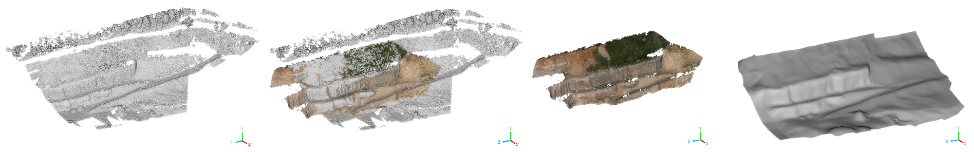

This repository holds the datasets related to the paper in the journal Data-in-Brief. They come from experimental and numerical large-scale rockfall tests that were performed in an open-mine pit in Authume (France), in the framework of the french national project [C2ROP](https://www.c2rop.fr/).

It includes experimental endpoints for 89 rock blocks launched over two profiles: P1 (41 blocks) and P2 (49 blocks). To permit further analysis, the bounding box sizes of the boulders and their masses are also provided.

Another data series were obtained by means of discrete element simulations (with the software Rockable) of isolated rockfall events, where both the blocks and the terrain topology were complex meshes. 
Totally ignoring the details of the numerical modelling that was used, the trajectories are made available for each digital block in both profiles, for 64 initial orientations (uniformly distributed), and for 4 drop points at the corners of an horizontal 4$\times$4 square. Geometric data-files, corresponding to field measures, are also included for the block shapes and the terrain topology. They are both obtained by photogrammetry. 

The data is the basis for the original paper by [Garcia *et al*.](#references) 
Both datasets from simulations or experiments can be used by researchers of the field to benchmark their own trajectory analysis tools and/or approaches. The data sets provided would be valuable for comparative study where the actual shape of the boulders (potentially non-convex) is of concern in rockfall forecasting.

# Experiments

### The site of Authume quarry: context and experimental procedures

[Photos site + location in France + context C2ROP]

|  |
|:--:|
| 
 Figure x. xxx 
 |

[Two drop points P1 and P2]

The rock blocks were extracted from the Authume quarry. Their volumes where selected in the range 0.1 and 0.75 m$^3$ (approximatively), and then weighted using a wire mesh basket connected to a piezoresistive force sensor (Chatillon SLC10000—accuracy ±20 kg). The weighing procedure consisted of pulling the load cell with the crane of the power shovel (it can be seen in some photographs above, at the drop points).

### Boulders and their deposite positions

The data files for the stop positions of the released boulders are named `EXP_endpoints/endpoints_P1.txt` (41 boulders) and `EXP_endpoints/endpoints_P2.txt` (48 boulders, the boulder at line #xx is the one with shape SP3A).
They are ASCII text files where the meaning of each column is described in the following table.  

| Column # | Description              |
|:--------:|:-------------------------|
| 1        | $x$ position (m)         |
| 2        | $y$ position (m)         |
| 3        | $z$ position (m)         |
| 4        | mass of the boulder (kg) |
| 5        | $L_1$ (m)                |
| 5        | $L_2$ (m)                |
| 5        | $L_3$ (m)                |

In this dataset, the lengths $L_1$, $L_2$ and $L_3$ ($L_1 \ge L_2 \ge L_3$), which define the bounding parallelogram that fits closely the bouder, where measures by different operators (see photograph below). The accuraty of these lengths is thus estimated at ±10 cm. 

|  |
|:--:|
| 
 Figure x. xxx 
 |

The block 89, shown in this photograph, is actually the only one that has been employed in both a rockfall test and in the the simulations presented below. Notice that the positions provided in the deposit datasets are expressed in the same cartesian framework that the one used in the simulation datasets. 

# Single rockfall simulations (Discrete Element Method)

[show photographs and top viewed map with colors, and the framework]

|  |
|:--:|
| 
 Figure x. xxx 
 |

### Geometries

##### Digital terrain

The terrain topology is provided in the form of `.stl` ASCII files, and also in a more raw format of cloud points (`.xyz` ASCII files) in the folders `Geometries/STL` and `Geometries/Point_cloud`, respectively.

Any position in the dataset of this repository is a cartesian coordinate expressed in the same framework. [says y is upwards, ref to top view]

The limits of the digital terrain, to the accuracy of one metre,  are given in the following table.

|         | min | max |
|---------|-----|-----|
| $x$ (m) | -8  | 109 |
| $y$ (m) | 148 | 215 |
| $z$ (m) | 217 | 428 |

There are actually 3 `.stl` files for the terrain topology; they can be merged border-to-border. They correspond to 3 zones of different types of subtratum. In the figure above, the blue zones are vegetated slopes, the gray zones correspond to hard surfaces (vertical rock walls and the horizontal sturdy soil), and the red zones are rocky slopes. 

To construct the Digital Terrain Model (DTM) of the propagation paths and stop zones of the quarry, a cloud of 3D points was first acquired by the photogrammetry technique, using aerial photographs shooted by a drone with 3-axis gimbal 4K camera ([DJI Mavic Pro](https://en.wikipedia.org/wiki/Mavic_(unmanned_aerial_vehicle)#Pro_series)). This model was provided by the IMSRN company.

A dense point cloud was provided by the C2ROP organization (see [ARTICLELANDSLIDESXX](xxx)) and aligned with Geographic Information System (GIS)  database to complete some missed areas (such as the bottom ground of the quarry) that were not totally covered by the drone. 
The mesh was then generated and simplified by degradation using the software MeshLab by targetting a minimal point spacing of 0.5 m. 

|  |
|:--:|
| <b>Figure 2. xxx</b> |

##### Digital boulders

[say how the digital blocks has been acquired and post-processed]

### Drop positions

For profiles P1 and P2 -> drop positions

### Trajectories

By means of discrete element simulations with the code [`Rockable`](https://richefeu.github.io/homepage-vrichefeu/tools/0000/01/02/rockable/),
the four digital boulders have been released from 4 drop positions in each profile P1 and P2. This corresponds to 2$\times$4$\times$4 series of simulations for 64 initial orientations, evenly distributed in all possible orientations. [say they are quaternions in `Drop_conditions/orientations.txt`]

A total of 2048 computed trajetories are organised according to the following tree structure in this repository: 

`Trajectories/`[Profile](#)`/`[Shape](#)`/`[Drop\_position](#)`/`[Orientation](#)`.txt` 

where [Profile](#) = {`P1`, `P2`}, [Shape](#) = {`SP1A`, `SP2A`, `SP2B`, `SP3A`}, [Drop_position](#) = {`Drop_position_1`, `Drop_position_2`, `Drop_position_3`, `Drop_position_4`}, and [orientation](#) = `orientation_`[1-64].

[The trajectory files contain 20 seconds of simulated rockfall data and are not simply composed of spatial positions, but also give information about kinetic and rotational velocities, orientations, forces and momentum at each time step.]

The trajectory datasets are ASCII text files with the following columns:

| Column # | Description                                    |
|:--------:|:-----------------------------------------------|
| 1        | Time from release (s)                          |
| 2        | $x$ position (m)                               |
| 3        | $y$ position (m)                               |
| 4        | $z$ position (m)                               |
| 5        | $v_x$ velocity (m/s)                           |
| 6        | $v_y$ velocity (m/s)                           |
| 7        | $v_z$ velocity (m/s)                           |
| 8        | $s$ scalar component of orientation quaternion |
| 9        | $x$ vector component of orientation quaternion |
| 10       | $y$ vector component of orientation quaternion |
| 11       | $z$ vector component of orientation quaternion |
| 12       | $x$ angular velocity (rad/s)                   |
| 13       | $y$ angular velocity (rad/s)                   |
| 14       | $z$ angular velocity (rad/s)                   |
| 15       | $x$ contact force (N)                          |
| 16       | $y$ contact force (N)                          |
| 17       | $z$ contact force (N)                          |
| 18       | $x$ contact moment (Nm)                        |
| 19       | $y$ contact moment (Nm)                        |
| 20       | $z$ contact moment (Nm)                        |

[explain how to transform quaternion into Euler angles (or rotation matrix)]

# References

* B. Garcia, P. Villard, V. Richefeu. D. Daudon, *Comparison of full-scale rockfall tests with 3D complex-shaped discrete element simulations*, Engineering Geology, In Press.

* F. Bourrier, D. Toe, B. Garcia, J. Baroth, S. Lambert (2021) *Experimental investigations on complex block propagation for the assessment of propagation models quality*, Landslides **18**, pp. 639-654

* `Rockable`, a discret element method software, developped in Laboratoire 3SR, Université Grenoble Alpes, France. [Description of the software](https://richefeu.github.io/homepage-vrichefeu/tools/0000/01/02/rockable/)
